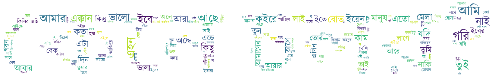
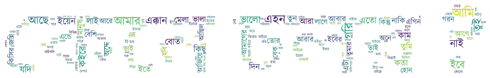
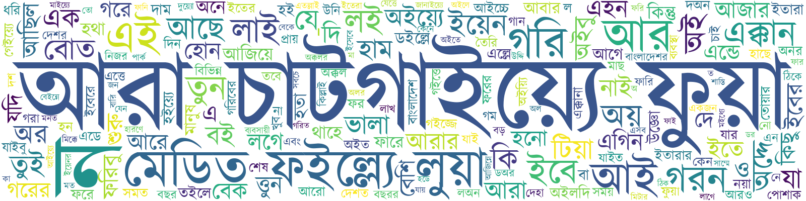
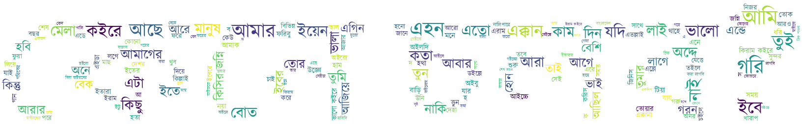
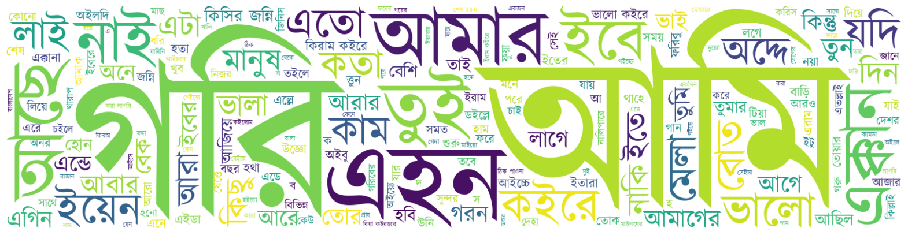

<!--  -->

<!--  -->

<!--  -->

# Research

Undergrad Research Work

## Publication

- Bangla Language Dialect Classification using Machine Learning. [Read Me!](https://ieeexplore.ieee.org/abstract/document/10114552)
  > International Conference on Electrical, Computer & Telecommunication Engineering (ICECTE 2022). ECE faculty of RUET organizes this conference once every 2 years.

## Google Scholar

Follow me on Google Scholar. [Let's Go!](https://scholar.google.com/citations?user=GIAwRq4AAAAJ&hl=en)
